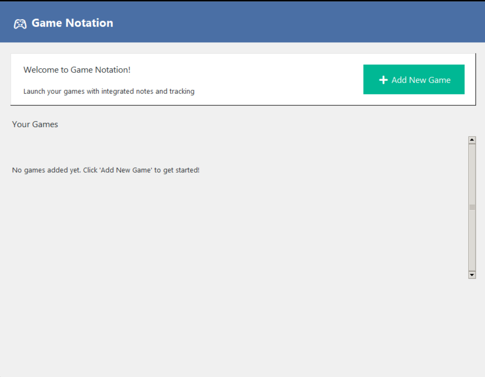
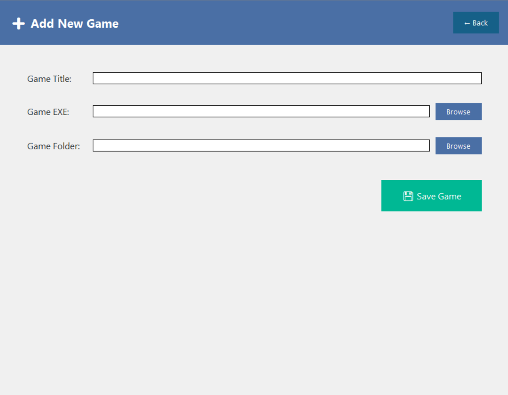

# 🎮 Game Notation



An application to create note taking capabilities to play games. This tool is for people ( like me ) who forgot what they did last when playing and it becomes daunting to pick the game back up again. Using this tool, you automatically interact with the notepad after you finish playing which allows you to note down what you did and what you plan to do.

## 📋 Features
- Launch games with pre-game notes
- Automatic notes reopening after gameplay
- Game management with delete functionality

## 🖥️ System Requirements
- Windows 7/8/10/11
- Python 3.7 or higher (if running from source)
- Administrative privileges (for process monitoring)

## 🚀 Installation Options

### Option 1: Run from Source Code

#### Prerequisites
1. Install Python 3.7+ from [python.org](https://www.python.org/downloads/)
2. Install Git from [git-scm.com](https://git-scm.com/downloads) (optional)

#### Setup Steps
```bash
# Clone the repository (or download ZIP)
git clone https://github.com/yourusername/game-launcher.git
cd game-launcher

# Install required packages
pip install -r requirements.txt

# Run the application
python Game.py
